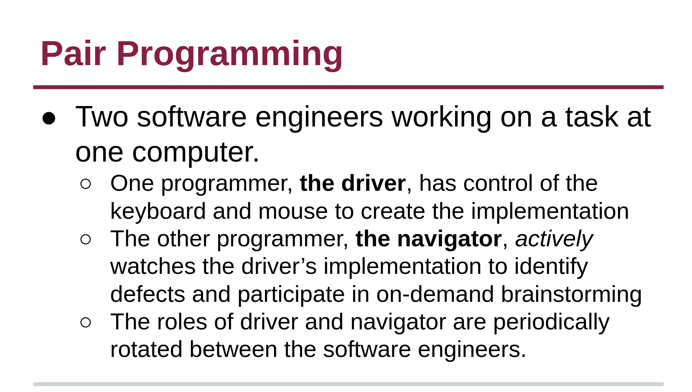

# Collaboration

Software engineering is rarely done alone. Thus, here are two concepts to streamline collaboration between software engineers developing and maintaining the same product.

## Pair Programming

Pair programming is a common practice in development environments where two software engineers work on a programming task together at the same computer.

## 📝 Activity

For the following activity, find a partner in class (or virtually if you are not in class) with shared knowledge of a programming language. Each student must complete a designated part of the program below _on their own machine_, while the partner **_actively_** participates in the coding.

> **Roman Numerals**
> 
> Roman numerals are depicted by using seven different symbols: `I, V, X, L, C, D and M` to represent seven different numerical values: `1, 5, 10, 50, 100, 500, 1000` (For example, the most recent Super Bowl LVI was Super Bowl 56). Complete the following for this activity:
> * One student will be the driver while the other navigates to write a function that converts an [integer to a Roman Numeral](https://leetcode.com/problems/integer-to-roman/). 
> * Then, students should switch roles to develop a function that converts [Roman numerals to integers](https://leetcode.com/problems/roman-to-integer/). 
> 
> The driver must complete their portion of the program on their own machine. When driving, each partner should add method-level comments to describe what the function does, who wrote it, and which IDE or text editor was used to write the code. Create your method(s) in a file named `Roman.<ext>`. You are not expected to come up with the most efficient or correct solution---this is an activity to practice pair programming, not a job interview. Only the conversion methods are needed.

Each partner should save their own file for later.

## Branching

More broadly, branches provide isolated development work environments that do not impact the main source code. _Merging_ is the process of combining the work from separate branches. Branches are useful for developing features, fixing bugs, organizing work, safely experimenting with the project in a contained area, or contributing to other repositories (i.e. branching is recommended as a good practice for submitting pull requests). Check out the following notebook to practice branching with git.

## 📝 Activity: Creating Branches on a Repo

For this activity, you will work with your pair programming partner to create branches on a repository. Please complete the following steps:

1. Each student should clone their partners' repository.
2. Create a new branch. The branch should be named your student ID (i.e. dcbrown).
3. Add your individual `Roman.<ext>` files to your new branch. Push these changes to your partner's remote repository.
4. Locally, switch back to the main branch and update the README file with your name and GitHub username. This will probably lead to a **merge conflict**, since at least one member of your team will have an outdated version. This is a common part of merging and programming in teams.
5. Fix or avoid the merge conflict to create a combined `Roman.<ext>` file with both methods and comments created by students in _one file_. Push this to the main branch.

## [Project Management ⏭️](Project.md)