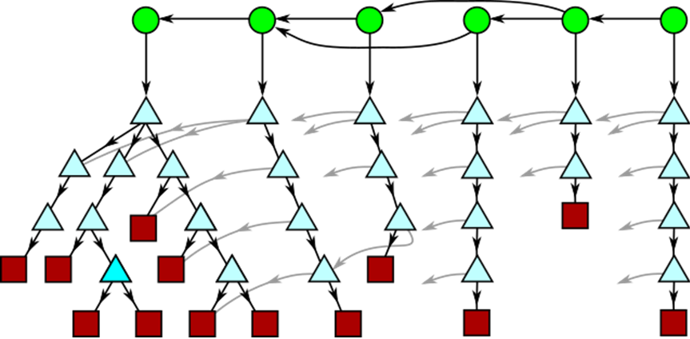
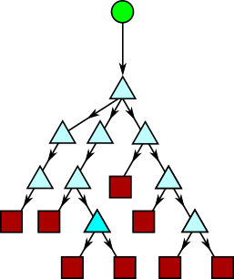

# Git


### Why Version Control?

> You're working on a team project and need to make edits to reports and code. You waiting for your team member to make a change and then email you back another a copy. There has to be a better way...

"Version control is the lab notebook of the digital world: it’s what professionals use to keep track of what they’ve done and to collaborate with other people. Every large software development project relies on it, and most programmers use it for their small jobs as well. And it isn’t just for software: books, papers, small data sets, and anything that changes over time or needs to be shared can and should be stored in a version control system." -- [Version Control with Git](http://swcarpentry.github.io/git-novice/)


## Understanding Git

What better way to understand git than to check out git itself! This might take a while...(run this locally)

```bash|{type:'command', failed_when:'exitCode != 0'}
git clone https://github.com/git/git
```

We'll be working inside the git/ directory. Let's set thet working state to v2.31.0

```bash|{type:'command'}
cd git
git reset --hard v2.31.0
```

### Git's Object Model: Content-Addressable Data Store.



* Every object has a SHA-1 hash: 40 hex characters.
* Given 40 hex characters, we can find the unique object with that hash.

Let's examine a single commit.

```bash|{type:'command', path: 'git', highlight: {word: '5fa0f5238b0cd46cfe7f6fa76c3f526ea98148d9', title:'This 40 hex id allows us to find this object inside the git object store.'}}
git log -1 --abbrev=40
```

**📝 Exercise:** Create a text file called `git.txt` to answer some questions throughout this activity. 1) What is the name of the author of the last commit on this version of git?

### Object Types: Blobs, Trees, Commits

Use the `git cat-file` command to help search for objects inside the store.
If we provide git with a partial hash, it will attempt to find a unique match, and if it is unable to, it will provide a list of those that did match.

```bash|{type:'command', path: 'git'}
git cat-file -p 8348
```

**📝 Exercise:** 2) How many objects share a partial match with the hash '8348'? 3) How many blobs, trees, and commits are there?

#### Blobs

Let's examine a **blob** object. A blob contains _file contents_. 


#### Trees

Let's examine a **tree** object. A tree contains _folder contents_. 


Example representation of folder contents contained by a tree: 


#### Commits 

Perhaps one of the most important type of object inside the object model is a commit. A **commit** contains many things:

* A root **tree**
* A list of **parent commits**
* A commit message
* An author name, email, time.
* A committer name, email, time.




Let's examine an example commit.

```bash|{type:'command', path: 'git', highlight: {word: "committer", title: "A committer can differ from an author, for example, a committer may be merging a pull request from another author."}}
git cat-file -p 834845
```

**📝 Exercise:** 3) In your own words, describe what this commit is doing?

#### Diffs

Diffs are _not_ part of the object model!

> **Commits are NOT diffs**

Instead, diffs are dynamically calculated from the commit graph inside the object store. For example, even object attributes, such as _file renames_ are not represented inside the datastore and must be calculated dynamically.

Let's examine a diff.

```bash|{type:'command', path: 'git'}
git diff --raw v2.31.0 v2.31.1
```

(Press 'q' to exit)

To get a closer look at specific changes, use:

```bash|{type:'command', path: 'git'}
git diff v2.31.0 v2.31.1
```

**📝 Exercise:** 4) What is the name of the first file listed that changed between versions 2.31.0 and 2.31.1?


### Branches

_Branches_ are simply pointers to commits. _Tags_ are pointers to anything (commits, trees, blobs).


More broadly, branches provide isolated development work environments that do not impact the main source code. _Merging_ is the process of combining the work from separate branches. Branches are useful for developing features, fixing bugs, organizing work, safely experimenting with the project in a contained area, or contributing to other repositories (i.e. branching is recommended as a good practice for submitting pull requests). Check out the following to practice branching with git.

#### Move between branches with git switch

`git switch` is a new feature in v2.23.0 of git. It essentially replaces and does less work than `git checkout`. Primarily, `git switch` will:

* Change `HEAD` to point to a new branch.
* Updates the working directory to match the commit's tree.

We can switch our branch to the maintenance branch.
```bash|{type:'command', path: 'git'}
git switch todo
```

Let's confirm.

```bash|{type:'command', path: 'git'}
git status ; git branch
```

We can return to the main branch.

```bash|{type:'command', path: 'git'}
git switch main
```

Use `git branch` to see the current branch and `git branch -a` to view a list of branches for the project.

**📝 Exercise:** 5) How many total branches are there for the git repository?

**From this point on, you do not need the git repository for any activities. You can remove it with the commands:**
```bash
cd .. # If you are currently in the top-level git directory
rm -rf git # This will delete things, so please remember to only run this for the 'git' directory
```

## 📝 Activity: Creating a Repo

Let's try the basics. A repository (repo) is where the backup (master) copies of all files are stored.
– **Local repository:** on your computer
– **Remote repository:** shared repository in the cloud

Let's create a new local git repository. 

(_Note:_ GitHub transitioned from passwords to requiring authentication tokens. If you do not have one, you will need to create one under 'Settings > Developer settings > Personal access tokens'. More details are available [here](https://docs.github.com/en/authentication/keeping-your-account-and-data-secure/managing-your-personal-access-tokens).)

Create a new directory (Basics) and file (README.md).

```bash|{type:'file', path: 'Basics/README.md'}
# CS6704 SE Basics Workshop
Hello!
```

We are going to create a new git repository, but maybe not the way you've done it before. 
In the next set of commands, we will be working inside the `Basics/` directory.

This will create a new .git directory to store commits and other objects.

```bash|{type:'command'}
git init
```

We can quickly inspect the contents of the git's directory and object store.

```bash|{type:'command', path: 'Basics'}
ls -l .git
ls -l .git/objects
```

Before adding a file to the repository, it must first be staged.

```bash|{type:'command', path: 'Basics'}
git add README.md
```

We will commit our staged changes into the repository.

```bash|{type:'command', path: 'Basics'}
git commit -m "initial commit"
```

**Nice work! We will revisit this later...**

### Stage, unstage, and discard changes

Changes flow from our working tree, to staging index, and into repository.


Use the following sets of steps to observe what happens to the _working tree_ and _index_, by running the `git status` command:

Update the README.md using the following commands in the Basics directory in the terminal:

```bash|{type:'command', path: 'Basics', shell: 'bash'}
echo " Update: $(date)" >> README.md
cat README.md
```

View the current state of our **working tree** and **index**.

```bash|{type:'command', path: 'Basics'}
git status
```

Unstaged changes should be displayed as red. To stage the changes and see the staging status, run the following:

```bash|{type:'command', path: 'Basics'}
git add README.md
git status
```

Staged files should be displayed as green in your terminal, indicating they are ready to be committed. 

Unstaging a file will remove the it from index, but keep the changes in a working tree. Discarding changes in worktree will result in loss of your work!

```bash|{type:'command', path: 'Basics'}
git restore --source=HEAD --staged --worktree README.md
```

### Remotes

While having a local git repository is cool, we should connect it to another remote repository. In other words, **we have no place to `git push` to**...


#### Remote operations

* Get new data: `git fetch <remote> [branch]`
* Upload your data: `git push <remote> <branch>`
* Get new data and merge into working tree: `git pull <remote> <refspec>`


## 📝 Activity: Let's create a remote repo!

Now let's push the local repository you created earlier to make it a remote repository! This will allow others on your team to access and make changes to the project.

1. Create a new _public_ repository on GitHub (https://github.com account is needed). Name your repository Basics and set a description to be something about "CS6704 Software Engineering Basics Workshop". Skip the initialization steps and create your repo.

2. Follow the instructions to add a remote url to an existing git repository (**push an existing repository from the command line**). It should start with something like: `git remote add origin https://github.com/<user>/<repo>.git`

3. Push your changes to GitHub. Verify you can see your updated README.md!

4. On GitHub, edit the README.md (click on the pencil icon in the top right corner of the file) to add your first and last name under the heading and modify the next line to say "Hello GitHub!". Commit the changes directly on GitHub. Now you have changes in your remote (origin) repository that are missing on your local copy.

5. Run `git pull` locally. Verify you now have the updated changes.

**This repository is where you will place all the materials from the workshop today. Add your FizzBuzz program, bash practice files, and `git.txt` file here.**

6. Clone your pair programming partner's repository. Create a new branch named your student ID (i.e. dcbrown). Add your individual `Roman.<ext>` file from the pair programming activity to your new branch. Push these changes to your partner's remote repository.


## [APIs ⏭️](APIs.md)
